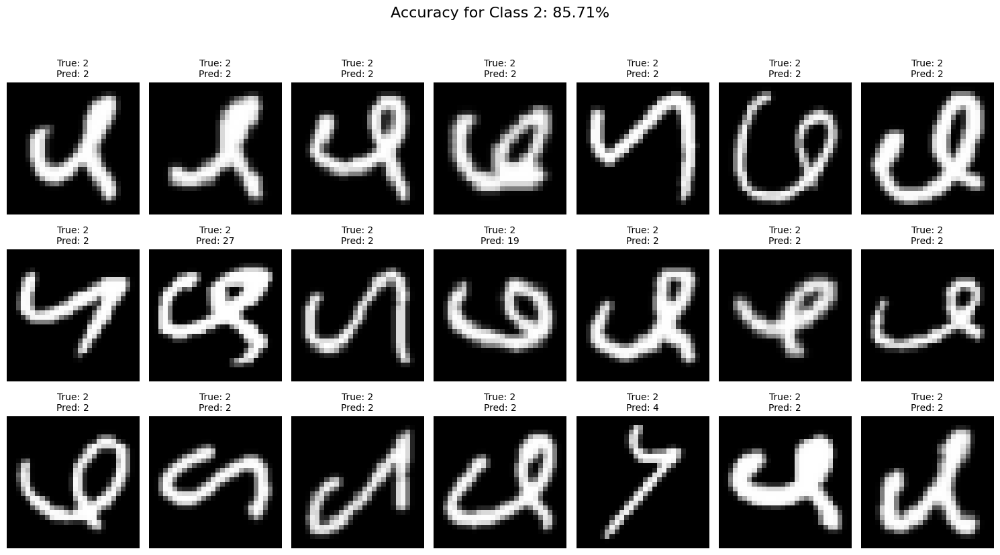
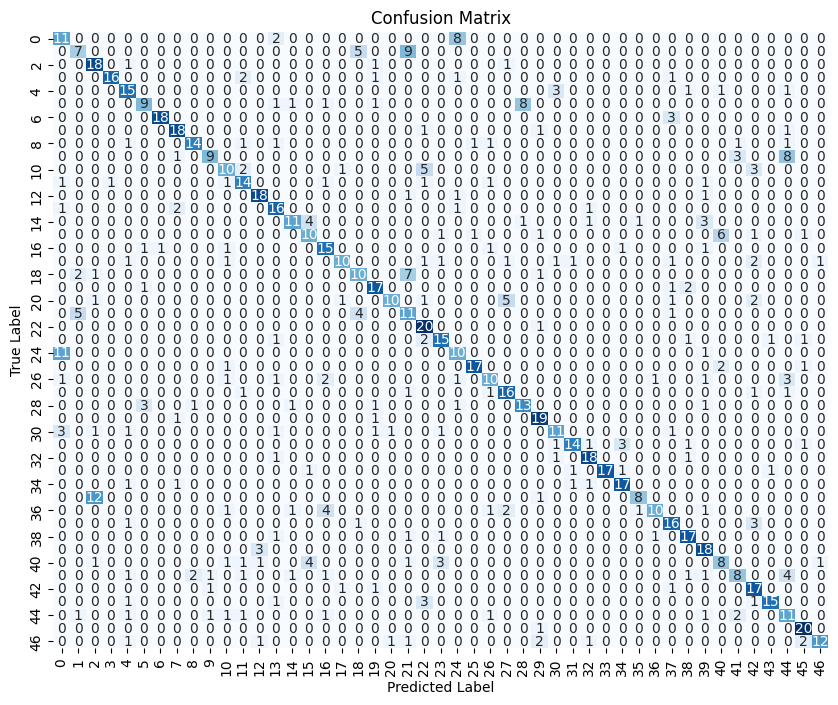
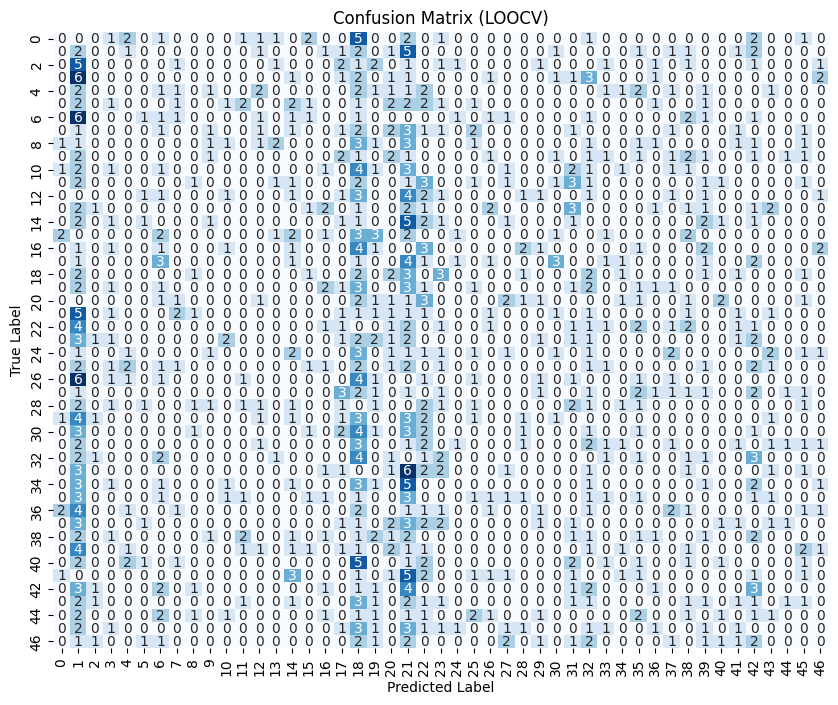

# Klasifikasi Karakter Tulisan Tangan dengan EMNIST dan CNN

Repository ini berisi proyek akhir untuk mata kuliah Machine Vision, yang berfokus pada klasifikasi karakter tulisan tangan menggunakan dataset EMNIST. Proyek ini menggunakan Convolutional Neural Networks (CNN) yang ditingkatkan dengan EfficientNet melalui transfer learning untuk mempercepat proses pelatihan. Evaluasi dilakukan menggunakan Leave-One-Out Cross-Validation (LOOCV), dengan menampilkan metrik seperti confusion matrix, akurasi, presisi, dan F1-score.

## Daftar Isi
- [Deskripsi Umum](#deskripsi-umum)
- [Teknologi dan Metodologi](#teknologi-dan-metodologi)
- [Hasil](#hasil)
- [Cara Penggunaan](#cara-penggunaan)
- [Informasi Lebih Lanjut](#informasi-lebih-lanjut)
- [Tentang Penulis](#tentang-penulis)
- [Kontak](#kontak)

## Deskripsi Umum
Tujuan dari proyek ini adalah untuk mengklasifikasikan karakter tulisan tangan menggunakan dataset EMNIST dengan memanfaatkan kemampuan CNN dan EfficientNet untuk hasil yang efisien dan akurat. Proyek ini diimplementasikan di Google Colab, menyediakan lingkungan yang fleksibel dan hemat sumber daya untuk eksperimen pembelajaran mendalam.

## Teknologi dan Metodologi
### Teknologi
- **Python**: Bahasa pemrograman utama.
- **TensorFlow/Keras**: Untuk membangun dan melatih model CNN.
- **EfficientNet**: Digunakan untuk transfer learning agar meningkatkan efisiensi pelatihan.
- **Google Colab**: Platform untuk implementasi dan eksperimen model.
- **Matplotlib & Seaborn**: Untuk visualisasi hasil pelatihan dan metrik evaluasi.

### Metodologi
1. **Persiapan Dataset**: Dataset EMNIST diproses agar kompatibel dengan model CNN.
2. **Desain Model**: Arsitektur CNN dibangun dan ditingkatkan menggunakan EfficientNet sebagai model dasar untuk transfer learning.
3. **Pelatihan**: Model dilatih menggunakan sumber daya GPU Google Colab.
4. **Evaluasi**: Metrik kinerja dihitung menggunakan LOOCV, termasuk:
   - Confusion Matrix
   - Akurasi
   - Presisi
   - F1-score

## Hasil
### Hasil Pelatihan
Berikut adalah preview gambar yang di tampilkan berdasarkan prediksi dan true labelnya:


*Gambar 1: Preview Data*

### Evaluasi
Hasil evaluasi model dirangkum melalui confusion matrix dan metrik utama:


*Gambar 2: Confusion matrix hasil klasifikasi*

### Evaluasi LOOCV
Hasil evaluasi model dengan menggunakan metode Leave-One-Out Cross Validation (LOOCV):


*Gambar 3: Confusion matrix eval LOOCV*

## Cara Penggunaan
### Prasyarat
- Akun Google Colab
- Python 3.x terinstal secara lokal (opsional untuk eksekusi offline)

### Langkah-Langkah Penggunaan Menggunakan Google Colab
1. Clone repository:
   ```bash
   git clone https://github.com/KacangSoya/4212201040_Computer-Vision-UAS.git
   ```
2. Buka notebook di Google Colab.
3. Upload dataset EMNIST pada direktori Google Colab.
4. Jalankan notebook untuk melatih dan mengevaluasi model.
5. Eksplorasi metrik dan visualisasi yang dihasilkan.

## Informasi Lebih Lanjut
Penjelasan lebih rinci tentang program dan implementasinya tersedia di video berikut:

[![Tonton Video]](https://youtu.be/HSU_eW_i7lQ)

## Tentang Penulis
**Nama**: Habib Sulaiman  
**Universitas**: Politeknik Negeri Batam  
**Prodi**: Mekatronika  
**Kelas**: MK 5B Pagi

## Kontak
Untuk pertanyaan atau kolaborasi:
- Email: Habibsulaiman816@gmail.com
- LinkedIn: [Habib Sulaiman](https://www.linkedin.com/in/habib-sulaiman/)
- GitHub: [KacangSoya](https://github.com/KacangSoya)
